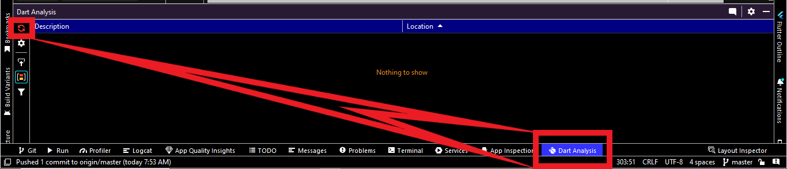

# crud_using_drift_package_flutter

A new Flutter project.

## Getting Started

This project is a starting point for a Flutter application.

A few resources to get you started if this is your first Flutter project:

- [Lab: Write your first Flutter app](https://docs.flutter.dev/get-started/codelab)
- [Cookbook: Useful Flutter samples](https://docs.flutter.dev/cookbook)

For help getting started with Flutter development, view the
[online documentation](https://docs.flutter.dev/), which offers tutorials,
samples, guidance on mobile development, and a full API reference.

## 1. Research: CRUD Operations With Drift Package Flutter

- Keywords:
    - flutter drift
    - flutter drift package
    - drift package flutter
    - drift database flutter
    - drift flutter example
    - flutter drift github
    - drift flutter example github
    - moor flutter
    - flutter drift tutorial
    - drift moor flutter
    - flutter drift vs sqflite
    - flutter drift tutorial
    - flutter drift update
    - flutter vs floor flutter
    - flutter drift relation
    - flutter drift tutorial
    - flutter drift provider
    - drift flutter
    - moor flutter example
    - moor flutter pub dev
    - moor generator flutter
    - moor database
    - flutter drift foreign key
- Video Title: Drift (Moor/sqlite) Database Package Flutter | Drift Package Flutter with CRUD
  Operations Example Github

## 2. Research: Competitors

**Flutter Videos/Articles**

- 2.8K: https://youtu.be/61kOwZeoa9I
- 1.3K: https://youtu.be/MlVL1lHW9LI
- Playlist: https://youtu.be/8ESbEFC0z5Y?list=PLztm2TugcV9Tn6J_H5mtxYIBN40uMAZgO
- Playlist: https://youtu.be/_xVWj0LXx24?list=PLnr97bWJJm5T5DsnQ6GurAaoTnJAnflmm
- 68K: https://youtu.be/zpWsedYMczM
- https://pub.dev/packages/drift
- https://morioh.com/p/38818a701008
- https://drift.simonbinder.eu/docs/getting-started/
- https://fluttertalk.com/flutter-crud-tutorial-using-drift-package/
- https://medium.com/@mustafatahirhussein/drift-moor-database-for-flutter-an-overview-f17ff8548d85
- https://morioh.com/p/f6424b29c6f8

**Android/Swift/React Videos**

- https://www.geeksforgeeks.org/android-sqlite-database-in-kotlin/
- https://medium.com/@imbilalhassan/saving-data-in-sqlite-db-in-ios-using-swift-4-76b743d3ce0e
- https://www.tutorialspoint.com/android/android_sqlite_database.htm
- https://www.javatpoint.com/android-sqlite-tutorial
- https://objectbox.io/flutter-databases-sqflite-hive-objectbox-and-moor/
- https://drift.simonbinder.eu/faq/
- https://dontpaniclabs.com/blog/post/2022/07/26/sqlite-and-swift/
- https://blog.canopas.com/ios-persist-data-using-sqlite-swift-library-with-swiftui-example-c5baefc04334
- https://medium.com/@imbilalhassan/saving-data-in-sqlite-db-in-ios-using-swift-4-76b743d3ce0e
- https://www.javatpoint.com/android-sqlite-tutorial
- https://www.npmjs.com/package/react-native-sqlite-storage
- https://blog.logrocket.com/using-sqlite-with-react-native/
- https://medium.com/infinitbility/react-native-sqlite-storage-422503634dd2
- https://www.educba.com/react-native-sqlite/
- https://dev-yakuza.posstree.com/en/react-native/react-native-sqlite-storage/
- https://reactnativecode.com/creating-sqlite-database-table-in-react-native/
- 59K: https://youtu.be/9LYn-OBO5qE
- Playlist: https://youtu.be/hJPk50p7xwA?list=PLSrm9z4zp4mGK0g_0_jxYGgg3os9tqRUQ
- 49K: https://youtu.be/CzGNaiSoh7E
- 24K: https://youtu.be/VnabHcf0e3w
- 14K: https://youtu.be/s32FuDBGBf8
- 17K: https://youtu.be/Dxz6ABHedXg
- 2.5K: https://youtu.be/falbK8dF9OE
- 2.6K: https://youtu.be/bmLkSyLmCvM
- 4.8K: https://youtu.be/2v0vY-u4ItA
- 5.6K: https://youtu.be/4zcFp8RluyA
- 9.8K: https://youtu.be/i93WabMZRYo
- 2.3K: https://youtu.be/EkEOi8T7yVw?list=PLAJklozSk6qce-wk4pK_exZhYT3IqdDWT
- 11K: https://youtu.be/1kSLd9oQX7c
- 59K: https://youtu.be/wAyizHBFQEs
- 31K: https://youtu.be/GkuPPJ7AOSQ
- 13K: https://youtu.be/VCN5Th19hZM
- 2.3K: https://youtu.be/EkEOi8T7yVw
- 1.8K: https://youtu.be/GmHKgHE5hPc

**Great Features**

- Drift is a reactive library to store relational data in Dart and Flutter applications.
- Drift is a reactive persistence library built on top of sqlite.
- You can find more features at [pub.dev/packages/drift](https://pub.dev/packages/drift).

**Problems from Videos**

- Question: Target of URI does not exist for the import `abb_db.g.dart`. Dart analyzer is not
  parsing the generated file.

Answer: Follow
this [link](https://stackoverflow.com/questions/44358331/dart-analyzer-is-not-parsing-the-dynamic-generated-files)
.

**Problems from Flutter Stackoverflow**

- https://stackoverflow.com/questions/72370038/build-runner-not-working-as-expected-in-flutter-drift
- https://stackoverflow.com/questions/44358331/dart-analyzer-is-not-parsing-the-dynamic-generated-files
- https://stackoverflow.com/questions/71637707/how-do-i-resolve-a-sqlite-error-1-in-flutter
- https://stackoverflow.com/questions/74962568/error-whe-use-where-statement-on-flutter-drift-query
- https://stackoverflow.com/questions/73436419/drift-moor-flutter-stateerror-bad-state-no-element-when-selecting-single-row
- https://stackoverflow.com/questions/73927618/flutter-drift-library-inconsistency-found-while-naming-table-and-doing-migration
- https://stackoverflow.com/questions/74741837/problem-with-flutter-drift-dao-when-calling-method-to-fetch-data-problem-is-the
- https://stackoverflow.com/questions/71597562/flutter-gives-error-by-using-drift-after-moor
- https://stackoverflow.com/questions/73051837/flutter-drift-parameters-prohibited-in-check-constraints
- https://stackoverflow.com/questions/60132243/app-database-generated-file-having-errors-in-moor-flutter
- https://stackoverflow.com/questions/72428719/drift-stream-not-updating-on-insert-update-and-delete

## 3. Video Structure

**Main Points / Purpose Of Lesson**

1. In this video, you will learn how to use CRUD operations using drift package which is based on
   top of sqlite.
2. Main points:
    - Add employee
    - Edit employee
    - Delete employee
3. After all these implementations, provider can also be used with them.

**The Structured Main Content**

1. Run `dart pub get drift` to add drift package in your project's pubspec.yaml file.
2. For this project:
    - You must follow [drift](https://drift.simonbinder.eu/docs/getting-started)
      official documentation for project setup.
    - According to above documentation:
        - Add sqlite3_flutter_libs, path_provider and path in dependencies.
        - Add drift_dev and build_runner in dev_dependencies.

3. Here is the output of this complete project:


4. In `main.dart` file, there are theming properties and MaterialApp's initialRoute property is
   calling `/` which is HomePage of this app.
5. widgets folder contains `CustomDatePickerFormField` and `CustomTextFormField` widgets.
6. route folder contains `route_generator.dart` file contains all routes with route settings and
   error route:

```dart
class RouteGenerator {
  static Route<dynamic> generateRoute(RouteSettings settings) {
    final args = settings.arguments;

    switch (settings.name) {
      case '/':
        return MaterialPageRoute(builder: (_) => const HomeScreen());
      case '/add_employee':
        return MaterialPageRoute(builder: (_) => const AddEmployeeScreen());
      case '/edit_employee':
        if (args is int) {
          return MaterialPageRoute(
              builder: (_) => EditOrDeleteEmployeeScreen(id: args));
        }
        return errorRoute();
      default:
        return errorRoute();
    }
  }

  static Route<dynamic> errorRoute() {
    return MaterialPageRoute(
      builder: (_) =>
          Scaffold(
            appBar: AppBar(
              title: const Text('No Route'),
            ),
            body: const Center(
              child: Text(
                'Sorry no route was found!',
                style: TextStyle(color: Colors.red, fontSize: 18.0),
              ),
            ),
          ),
    );
  }
}

```

7. data folder contains local folder inside it. data folder may contain remote folder also. For
   drift sqlite database, we are using local database.

   Inside local, there is db folder and entity folder.

    - entity folder contains `employee_entity.dart` file. This file is importing drift package. It
      used to create table. So, every class will extend Table from drift package.
    - Table of drift uses IntColumn for integers, TextColumn for text and DateTimeColumn for data of
      birth.
    - id of user is assigned automatically using autoIncrement() function of drift which will also
      make this column the primary key of the table. For this reason, you can't use an autoIncrement
      column and also set a custom Table.primaryKey on the same table.

```dart
class Employee extends Table {
  IntColumn get id => integer().autoIncrement()();

  TextColumn get userName => text().named('user_name')();

  TextColumn get firstName => text().named('first_name')();

  TextColumn get lastName => text().named('last_name')();

  DateTimeColumn get dateOfBirth => dateTime().named('date_of_birth')();
}

```

- db folder contains `app_db.dart` and `app_db.g.dart`. `app_db.g.dart` file is created after
  writing code of `app_db.dart`.

  Code of `app_db.dart` is following:

```dart
import 'dart:io';

import 'package:drift/drift.dart';
import 'package:drift/native.dart';
import '/data/local/entity/employee_entity.dart';
import 'package:path_provider/path_provider.dart';
import 'package:path/path.dart' as path;

part 'app_db.g.dart';

LazyDatabase openConnection() =>
    LazyDatabase(() async {
      final dbFolder = await getApplicationDocumentsDirectory();
      final file = File(
        path.join(dbFolder.path, 'employee.sqlite'),
      );
      return NativeDatabase(file);
    });

@DriftDatabase(tables: [Employee])
class AppDb extends $AppDb {
  AppDb() : super(openConnection());

  @override
  int get schemaVersion => 1;

  Future<List<EmployeeData>> getEmployees() async =>
      await (select(employee).get());

  Future<EmployeeData> getEmployee(int id) async =>
      await (select(employee)
        ..where((tbl) => tbl.id.equals(id))).getSingle();

  Future<bool> updateEmployee(EmployeeCompanion entity) async =>
      await update(employee).replace(entity);

  Future<int> insertEmployee(EmployeeCompanion entity) async =>
      await into(employee).insert(entity);

  Future<int> deleteEmployee(int id) async =>
      await (delete(employee)
        ..where((tbl) => tbl.id.equals(id))).go();
}
```

There is openConnection() method which is returning LazyDatabase.

- getApplicationDocumentsDirectory of path_provider package is the directory where the application
  may place data that is user-generated.
- File of dart:io creates a new File object named `employee.sqlite` in the path of
  getApplicationDocumentsDirectory.
- Then this LazyDatabase return the NativeDatabase with file `employee.sqlite`.
- `@DriftDatabase(tables: [Employee])` tells drift the names of all tables here.

  <br/>
  `AppDb` class is extending $AppDb which is from auto generated `app_db.g.dart`. After writing it, it will 
  show error, but after completing the code up to constructor of this file, I will run a command and file
  will be auto generated.
  <br/>

- schemaVersion is overriding from `app_db.g.dart` file. It specifies the schema version of
  database.
- openConnection method is called in the constructor of this `AppDb` class. `
  AppDb() : super(openConnection());`
- Then run `flutter pub run build_runner build --delete-conflicting-outputs` in terminal to
  generate `app_db.g.dart` file. Be patient, it will take some time.
- If `app_db.g.dart` file is generated and your project does not recognize it, re-run dart analysis
  server which is in the bottom near terminal tab.
  

    <br/>
    After generating `app_db.g.dart` file, define following methods in `app_db.dart` file
    <br/>

- `getEmployees()` gives list of employee data.
- `getEmployee()` gives data of single employee.
- `updateEmployee()` updates data of single employee.
- `insertEmployee()` inserts a new employee.
- `deleteEmployee()` deletes an employee.


8. screen folder contains all screens of this project:
   `home_screen.dart` file, initialize following:

```dart 
late AppDb db;
List<EmployeeData> employeesForUi = [];
List<EmployeeData> employeeFromApi = [];

@override
void initState() {
  super.initState();
  db = AppDb();
  SystemChannels.textInput.invokeMethod('TextInput.hide');
}

Future<List<EmployeeData>> refreshUsersFromApi() async {
  final employeesFromApi = await db.getEmployees();
  setState(() {
    employeesForUi = employeesFromApi;
  });
  return employeesForUi;
}

@override
void dispose() {
  db.close();
  super.dispose();
}
```

Code of UI is following:

```dart 
Scaffold(
        appBar: AppBar(
          title: const Text('CRUD Operations With Drift Flutter'),
        ),
        body: RefreshIndicator(
          onRefresh: refreshUsersFromApi,
          child: FutureBuilder<List<EmployeeData>>(
            future: db.getEmployees(),
            builder: (context, snapshot) {
              final employees = snapshot.data;
              if (snapshot.connectionState != ConnectionState.done) {
                return const Center(
                  child: CircularProgressIndicator(),
                );
              }
              if (snapshot.hasError) {
                return Center(
                  child: Text(snapshot.error.toString()),
                );
              }
              if (employees != null) {
                return ListView.builder(
                  itemCount: employees.length,
                  itemBuilder: (context, index) {
                    final employee = employees[index];
                    return GestureDetector(
                      onTap: () => Navigator.pushNamed(
                        context,
                        '/edit_employee',
                        arguments: employee.id,
                      ),
                      child: Card(
                        shape: const RoundedRectangleBorder(
                            side: BorderSide(
                              color: Colors.green,
                              style: BorderStyle.solid,
                              width: 1.2,
                            ),
                            borderRadius: BorderRadius.only(
                              topLeft: Radius.circular(16.0),
                              bottomRight: Radius.circular(16.0),
                            )),
                        child: Padding(
                          padding: const EdgeInsets.all(12.0),
                          child: Column(
                            crossAxisAlignment: CrossAxisAlignment.start,
                            children: [
                              Text(employee.id.toString()),
                              Text(employee.userName),
                              Text(employee.firstName),
                              Text(employee.lastName),
                              Text(employee.dateOfBirth.toString()),
                            ],
                          ),
                        ),
                      ),
                    );
                  },
                );
              }
              return const Text('No data found');
            },
          ),
        ),
        floatingActionButton: FloatingActionButton.extended(
          onPressed: () => Navigator.pushNamed(context, '/add_employee'),
          icon: const Icon(Icons.add),
          label: const Text('Add Employee'),
        ),
      );
}
```

It uses RefreshIndicator to refresh employee list.

It uses FutureBuilder to get employee list.

It uses ListView builder to show employee list.

9. In `add_employee_screen.dart`, declare the following:
   ```dart 
    final formKey = GlobalKey<FormState>();
    final userNameController = TextEditingController();
    final firstNameController = TextEditingController();
    final lastNameController = TextEditingController();
    final dateOfBirthController = TextEditingController();
    DateTime? dateOfBirth;
    late AppDb db;
    ```
   use initState and dispose to initialize db and dispose db and text controllers.

    ```dart
      @override
    void initState() {
      super.initState();
      db = AppDb();
    }
    
    @override
    void dispose() {
      db.close();
      userNameController.dispose();
      firstNameController.dispose();
      lastNameController.dispose();
      dateOfBirthController.dispose();
      super.dispose();
    }
    ```
   UI code of `add_employee_screen.dart` is following:

```dart 
Scaffold(
        appBar: AppBar(
          title: const Text('Add Employee'),
          actions: [
            IconButton(
              onPressed: addEmployee,
              icon: const Icon(Icons.save),
            ),
          ],
        ),
        body: Padding(
          padding: const EdgeInsets.all(8.0),
          child: Form(
            key: formKey,
            child: SingleChildScrollView(
              child: Column(
                children: [
                  CustomTextFormField(
                    textLabel: 'User name',
                    controller: userNameController,
                  ),
                  const SizedBox(height: 8),
                  CustomTextFormField(
                    textLabel: 'First name',
                    controller: firstNameController,
                  ),
                  const SizedBox(height: 8),
                  CustomTextFormField(
                    textLabel: 'Last name',
                    controller: lastNameController,
                  ),
                  const SizedBox(height: 8),
                  CustomDatePickerFormField(
                    dateOfBirthController: dateOfBirthController,
                    txtLabel: 'Date of Birth',
                    callback: () => pickDateOfBirth(context),
                  ),
                ],
              ),
            ),
          ),
        ),
      );
```

pickDateOfBirth() method:

```dart 
 Future<void> pickDateOfBirth(BuildContext context) async {
  final initialDate = DateTime.now();
  final newDate = await showDatePicker(
    context: context,
    initialDate: dateOfBirth ?? initialDate,
    firstDate: DateTime(initialDate.year - 100),
    lastDate: DateTime(initialDate.year + 1),
    builder: (context, child) =>
        Theme(
          data: ThemeData().copyWith(
            colorScheme: const ColorScheme.light(
              primary: Colors.pink,
              onPrimary: Colors.white,
              onSurface: Colors.black,
              background: Colors.white,
            ),
          ),
          child: child ?? const Text(''),
        ),
  );
  if (newDate == null) {
    return;
  }
  setState(() {
    dateOfBirth = newDate;
    final dob = DateFormat('dd/MM/yyyy').format(newDate);
    dateOfBirthController.text = dob;
  });
}
```

addEmployee() method:

If the from is valid then `EmployeeCompanion` is called from `app_db.g.dart` to insert new employee.

entity is made using `EmployeeCompanion`. `db.insertEmployee(entity)` is called to insert employee
entity. After insertEmployee, .then() can be used what to do when a new employee is inserted.

```dart
 void addEmployee() {
  final isValid = formKey.currentState?.validate();
  if (isValid != null && isValid) {
    final entity = EmployeeCompanion(
      userName: drift.Value(userNameController.text),
      firstName: drift.Value(firstNameController.text),
      lastName: drift.Value(lastNameController.text),
      dateOfBirth: drift.Value(dateOfBirth!),
    );

    db.insertEmployee(entity).then(
          (value) =>
          ScaffoldMessenger.of(context).showMaterialBanner(
            MaterialBanner(
              backgroundColor: Colors.pink,
              content: Text(
                'New employee inserted: $value',
                style: const TextStyle(color: Colors.white),
              ),
              actions: [
                Builder(
                  builder: (context) =>
                      TextButton(
                        onPressed: () =>
                            ScaffoldMessenger.of(context)
                                .hideCurrentMaterialBanner(),
                        child: const Text(
                          'Close',
                          style: TextStyle(color: Colors.white),
                        ),
                      ),
                ),
              ],
            ),
          ),
    );
    Navigator.pushNamedAndRemoveUntil(context, '/', (route) => false);
  }
}
```

10. In `edit_or_delete_employee_screen.dart`, id is required in order to edit or delete an employee.

Initialize using initState and dispose the following:

```dart

final formKey = GlobalKey<FormState>();
final userNameController = TextEditingController();
final firstNameController = TextEditingController();
final lastNameController = TextEditingController();
final dateOfBirthController = TextEditingController();
DateTime? dateOfBirth;
late AppDb db;
late EmployeeData employeeData;

@override
void initState() {
  super.initState();
  db = AppDb();
  getEmployee();
}

@override
void dispose() {
  db.close();
  userNameController.dispose();
  firstNameController.dispose();
  lastNameController.dispose();
  dateOfBirthController.dispose();
  super.dispose();
}


Future<void> getEmployee() async {
  employeeData = await db.getEmployee(widget.id);
  userNameController.text = employeeData.userName;
  firstNameController.text = employeeData.lastName;
  lastNameController.text = employeeData.firstName;
  dateOfBirthController.text = employeeData.dateOfBirth.toString();
}
```

All previous data of employee of specific id is loaded through `getEmployee()` method in initState()
.

UI code of this screen is following:

```dart 
Scaffold(
        appBar: AppBar(
          title: const Text('Edit Employee'),
          actions: [
            IconButton(
              onPressed: () {
                editEmployee();
                Navigator.pushNamedAndRemoveUntil(
                    context, '/', (route) => false);
              },
              icon: const Icon(Icons.save),
            ),
            IconButton(
              onPressed: deleteEmployee,
              icon: const Icon(Icons.delete),
            ),
          ],
        ),
        body: Padding(
          padding: const EdgeInsets.all(8.0),
          child: Form(
            key: formKey,
            child: SingleChildScrollView(
              child: Column(
                children: [
                  CustomTextFormField(
                    textLabel: 'User name',
                    controller: userNameController,
                  ),
                  const SizedBox(height: 8),
                  CustomTextFormField(
                    textLabel: 'First name',
                    controller: firstNameController,
                  ),
                  const SizedBox(height: 8),
                  CustomTextFormField(
                    textLabel: 'Last name',
                    controller: lastNameController,
                  ),
                  const SizedBox(height: 8),
                  CustomDatePickerFormField(
                    dateOfBirthController: dateOfBirthController,
                    txtLabel: 'Date of Birth',
                    callback: () => pickDateOfBirth(context),
                  ),
                ],
              ),
            ),
          ),
        ),
      );
```

pickDateOfBirth() is same as in add_employee_screen.dart file.

deleteEmployee() method is following:

It uses `db.deleteEmployee(widget.id)`. .then() can also be used after deleteEmployee() is
successful.

```dart
  void deleteEmployee() {
  db.deleteEmployee(widget.id).then(
        (value) {
      return ScaffoldMessenger.of(context).showMaterialBanner(
        MaterialBanner(
          backgroundColor: Colors.pink,
          content: Text(
            'Employee deleted: ${widget.id}',
            style: const TextStyle(color: Colors.white),
          ),
          actions: [
            Builder(
              builder: (context) =>
                  TextButton(
                    onPressed: () =>
                        ScaffoldMessenger.of(context).hideCurrentMaterialBanner(),
                    child: const Text(
                      'Close',
                      style: TextStyle(color: Colors.white),
                    ),
                  ),
            ),
          ],
        ),
      );
    },
  );
  Navigator.pushNamedAndRemoveUntil(context, '/', (route) => false);
}
```

editEmployee() method is similar to the addEmployee() method is add_employee_screen.dart except the
one parameter id which is `id: drift.Value(widget.id),` in EmployeeCompanion entity.
